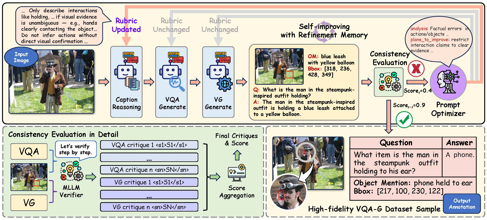
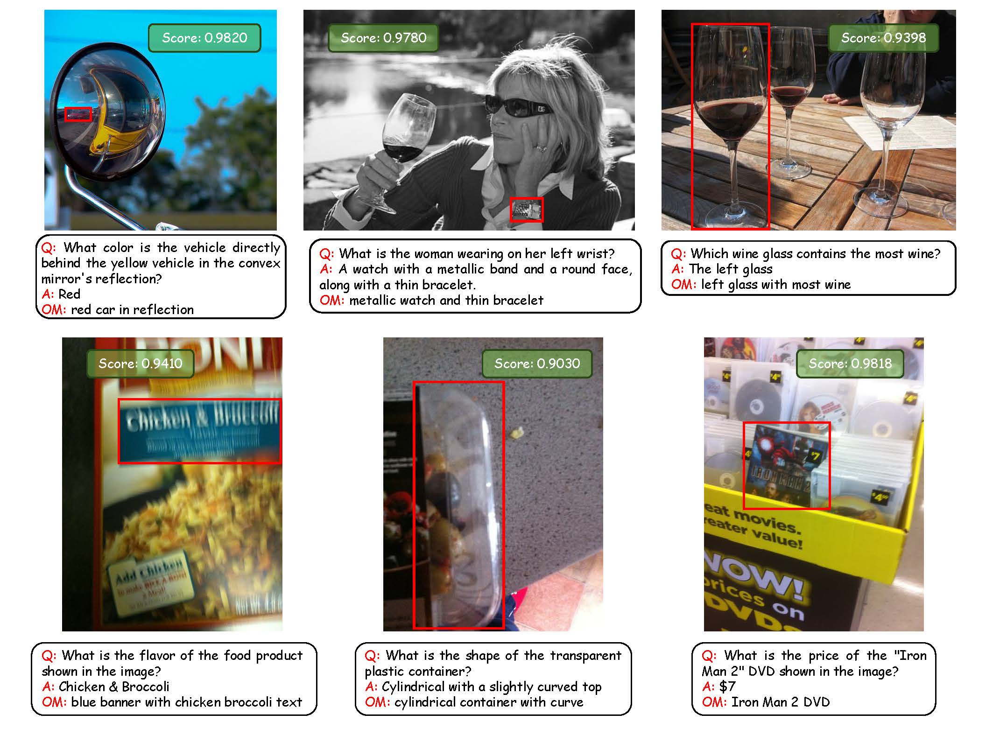

# AutoVQA-G: Self-Improving Agentic Framework for Automated Visual Question Answering and Grounding Annotation

**A self-improving agentic framework for automated high-fidelity Visual Question Answering Grounding (VQA-G) dataset generation**

  

## Overview

Manual annotation of high-quality Visual Question Answering with Grounding (VQA-G) datasets, which pair visual questions with evidential grounding, is crucial for advancing vision-language models (VLMs), but remains unscalable. Existing automated methods are often hindered by two key issues: **(1)** inconsistent data fidelity due to model hallucinations; **(2)** brittle verification mechanisms based on simple heuristics. To address these limitations, we introduce AutoVQA-G, a self-improving agentic framework for automated VQA-G annotation. AutoVQA-G employs an iterative refinement loop where a Consistency Evaluation module uses Chain-of-Thought (CoT) reasoning for fine-grained visual verification. Based on this feedback, a memory-augmented Prompt Optimization agent analyzes critiques from failed samples to progressively refine generation prompts. Our experiments show that AutoVQA-G generates VQA-G datasets with superior visual grounding accuracy compared to leading multimodal LLMs, offering a promising approach for creating high-fidelity data to facilitate more robust VLM training and evaluation. **We will release the full code after the paper is accepted.**

## Qualitative Examples

Qualitative examples generated by AutoVQA-G. The framework successfully produces high-consistency data across diverse scenarios, showcasing complex reasoning in QA pairs and precise, fine-grained visual grounding. **(Better viewed zoomed in)**

## Prompt Templates

We provide the prompt templates used in our framework for reproducibility. These templates can be found in the `prompts/` directory of the repository.

## License

This project is licensed under the MIT License - see the [LICENSE](LICENSE) file for details.
